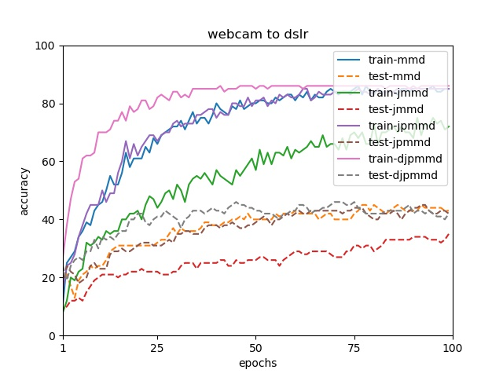

## Domain Adaptive Neural Networks with DJP-MMD

This repository contains codes of the DJP-MMD metric proposed in IJCNN 2020. We later extended its to deep neural networks [Domain Adaptive Neural Networks (DaNN)](https://link.springer.com/chapter/10.1007/978-3-319-13560-1_76) by replacing the marginal MMD in DaNN. Considering this work has not been published, if you are interested in this method, please cite the original paper.

## Requirements

- [PyTorch](https://pytorch.org/) (version >= 0.4.1)
- [scikit-learn](https://scikit-learn.org/stable/)

## Experiments

We perform the DJP-MMD in Domain Adaptive Neural Networks in [ Office-Caltech10](https://github.com/jindongwang/transferlearning/tree/master/data#office-caltech10) raw images, and this new metric shows better convergence speed and accuracy.

<div align="center">
    
</div>

## Citation

This code is corresponding to our [paper](https://ieeexplore.ieee.org/document/9207365) below:

```
@Inproceedings{wenz20djpmmd,
  title={Discriminative Joint Probability Maximum Mean Discrepancy (DJP-MMD) for Domain Adaptation},
  author={Wen, Zhang and Dongrui Wu},
  booktitle={Proc. Int'l Joint Conf. on Neural Networks},
  year={2020},
  month=jul,
  pages={1--8},
  address={Glasgow, UK}
}
```

Please cite our paper if you like or use our work for your research, thank you very much!

